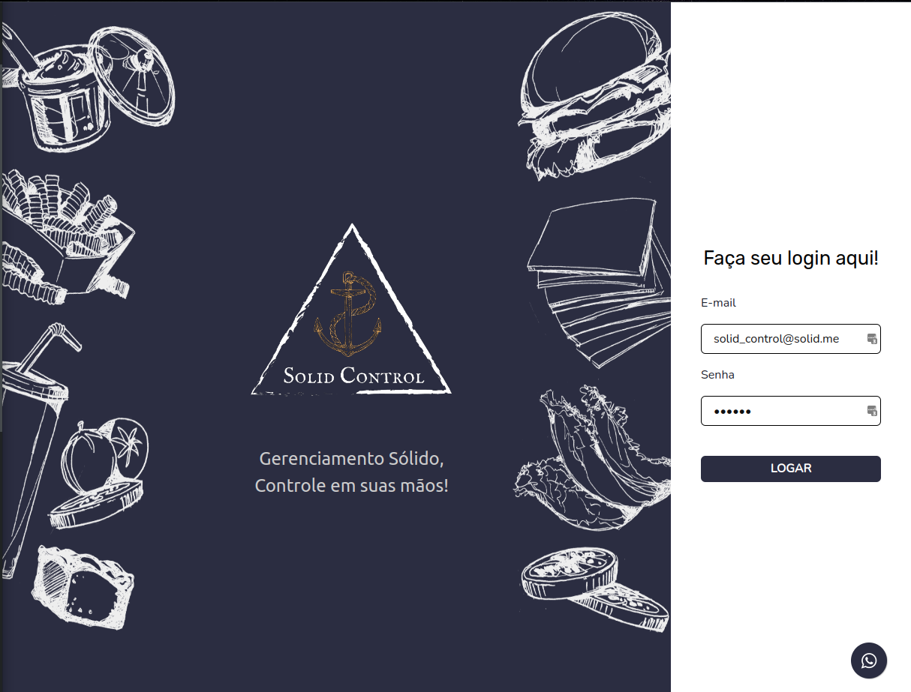

<h1 align="center"> Solid Control ⚓  </h1>

<h2> Descrição do Projeto </h2>

Solid Control é um CRM (customer relationship manager) que foi idealizado visando descomplicar o gerenciamento de pequenas e médias empresas, trazendo soluções em cadastro e controle de produtos finais e matérias-primas, relatórios sobre entradas e saídas, emissão de novos pedidos para clientes internos e externos, cadastro de fornecedores, clientes e funcionãrios, entre outras funcionalidades. <strong>Tudo isso de forma simples, clara e intuitiva, como todo software deve ser! :blush: :rocket:</strong>

### Login para teste da dashboard:
email: solid_control@solid.me
password: 123456

<h1 align="center"> 
	🚧  Em construção...  🚧
</h1>
 :zap: Tech Stack
<h1 align="center">
  
   
</h1>

